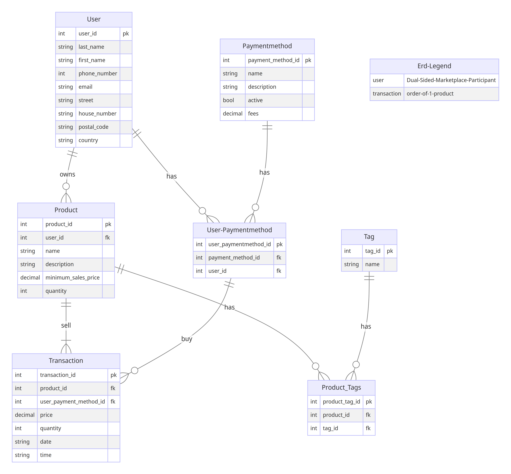

Important !!  
Please read this document in Open Preview: Ctrl+Shift+V, or Right-click 'README_USAGE_GUIDE.md'  
in the vsCode Explorer and then select the first option 'Open Preview'.

## Table of contents
- [INTRO](#intro)
- [REQUIREMENTS](#requirements)
  - [DB-MODELS](#db-models)
  - [DB-SETUP](#db-setup)
  - [DB-QUERIES (IN MAIN.PY)](#db-queries-in-mainpy)
  - [BONUS](#bonus)
    - [BONUS\_MODELS.PY](#bonus_modelspy)
    - [BONUS\_DB-QUERIES (IN MAIN.PY)](#bonus_db-queries-in-mainpy)
- [DATA-MODEL](#data-model)

 

# INTRO
[Table of contents](#table-of-contents)

 
Welcome to Betsy Webshop. 

 
 

# REQUIREMENTS

## DB-MODELS
[Table of contents](#table-of-contents)

Define your models and initialize the database in models.py  
A key part of the Betsy webshop is the database. At its core are the users and the products they offer:
1.	A user has a name, address data, and billing information.
2.	Each user must be able to own a number of products.
3.	The products must have a name, a description, a price per unit, and a quantity describing the amount in stock.
4.	The price should be stored in a safe way; rounding errors should be impossible.
5.	The tags should not be duplicated.
6.	We want to be able to track the purchases made on the marketplace, therefore a transaction model must exist
7.	You can assume that only users can purchase goods
8.	The transaction model must link a buyer with a purchased product and a quantity of purchased items

 
 

## DB-SETUP
[Table of contents](#table-of-contents)

To test if your database and queries are working we want to be able to populate the  
database with data quickly. 
1.	Add a populate_test_database function that fills the database with example data  
    that works with your queries

 
 

## DB-QUERIES (IN MAIN.PY)
[Table of contents](#table-of-contents)

In order to manage the database, the webshop must have a number of querying utlities.  
The scaffolding for the utilities can be found in main.py Extend the methods with the relevant functionality.  
In this first iteration of the database we want to be able to:  

1.	Search for products based on a term. Searching for 'sweater' should yield all products that have the word  
    'sweater' in the name. This search should be case-insensitive
2.	View the products of a given user.
3.	View all products for a given tag.
4.	Add a product to a user.
5.	Remove a product from a user.
6.	Update the stock quantity of a product.
7.	Handle a purchase between a buyer and a seller for a given product

 
 

## BONUS
[Table of contents](#table-of-contents)

### BONUS_MODELS.PY
[Table of contents](#table-of-contents)

As a bonus requirement, you must consider the various constraints for all fields and incorporate  
these constraints in the data model. 
 
 

### BONUS_DB-QUERIES (IN MAIN.PY)
[Table of contents](#table-of-contents)

In the next phase of development, the search functionality of the betsy webshop should be optimized. 

1.	The search should target both the name and description fields.
2.	Additionally the products should be indexed so that the time spent on querying them is minimized.
3.	Finally the search should account for spelling mistakes made by users and return products even if a spelling error is present
 
 

# DATA-MODEL
[Table of contents](#table-of-contents)
 

The erd is based on the requirements of the previous chapter. 

 

 

About the billing information.  
Billing info consists of:
1. last name
2. first name
3. address
4. phone nr
5. email address
6. payment information

The billing information is represented as part of the tables User and Payment-Method, because  
the billing information is simple and only contains a few fields. 

 
 